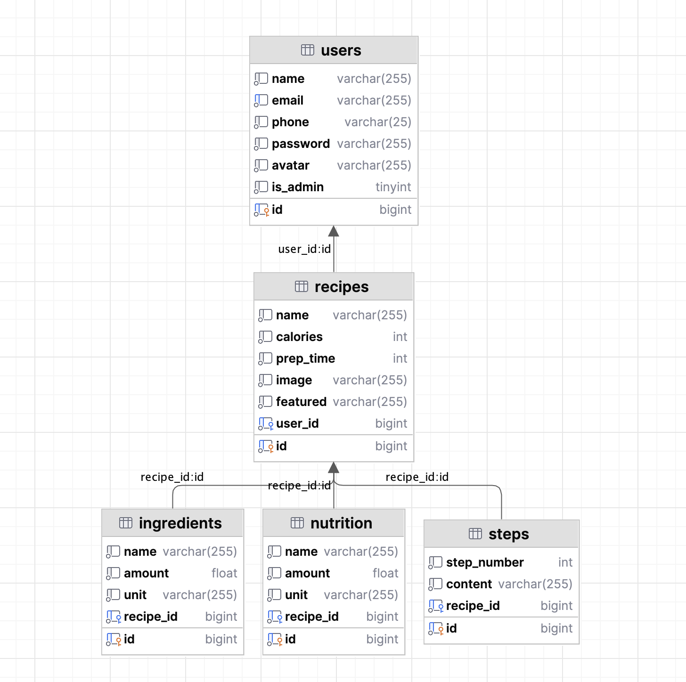

## COOKBOOK

### DB Schema used


### API ENDPOINTS
### `POST login`  
response codes: 200 on success, 401 on failure
request
```json
{
	"email": "casper@gmail.com",
	"password": "1234qwer"
}
```
response
```json
{
    "id": 13,
    "name": "Casper (KMUTT)",
    "email": "casper@gmail.com",
    "phone": "12345678",
    "avatar": "ce9cda02-6d3e-484b-8872-1d41625dad9a.webp",
    "is_admin": 0
}
```

### `POST register`  
response codes: 201 on success, 400 on malformed
mime: `multipart/formdata`  
request

| field name | value |
| --- | --- |
| name | casper |
| password | 1234qwer |
| email | caspers@gmail.com |
| phone | 09795785146 |

response
```json
{
  "success": true
}
```

### `POST profile`  
response codes: 200 on success, 401 on unauthorized access

### `PATCH profile`
response codes: 200 on success, 401 on unauthorized access

### `GET profile`  
response codes: 200 on success, 401 on unauthorized access

### `GET my_reipes`  
response codes: 200 on success, 401 on unauthorized access

### `POST recipes`  
response codes: 200 on success, 401 on unauthorized access

### `GET recipes`  
response codes: 200 on success

response
```json
{
  "data": [
    {
      "id": 60,
      "name": "Beef Noodles",
      "image": "574f1313-2aab-4d47-a401-c651ebf138d1.jpeg",
      "calories": 400,
      "prep_time": 60,
      "user": {
        "id": 12,
        "name": "Soe Thandar Lwin (KMUTT)",
        "avatar": "f894e8f5-12e4-44b1-b246-6239b76964e4.webp"
      }
    },
    {
      "id": 61,
      "name": "Grilled Chicken",
      "image": "5d38b8f1-cdc0-486e-a4a0-4b8ec9028eda.jpeg",
      "calories": 40,
      "prep_time": 15,
      "user": {
        "id": 13,
        "name": "Casper (KMUTT)",
        "avatar": "ce9cda02-6d3e-484b-8872-1d41625dad9a.webp"
      }
    },
  ]
}
```

### `GET recipes/:id`  
response codes: 200 on success
```json
{
	"id": 60,
	"name": "Beef Noodles",
	"image": "574f1313-2aab-4d47-a401-c651ebf138d1.jpeg",
	"user": {
		"id": 12,
		"name": "Soe Thandar Lwin (KMUTT)"
	},
	"ingredients": [
		{
			"id": 29,
			"name": "Beef",
			"amount": 200,
			"unit": "grams"
		},
		{
			"id": 30,
			"name": "Noodles",
			"amount": 2,
			"unit": "packets"
		}
	],
	"steps": [
		{
			"id": 5,
			"step_number": 1,
			"content": "Mince the beef"
		},
		{
			"id": 6,
			"step_number": 2,
			"content": "Boil the noodles"
		}
	],
	"nutritions": [
		{
			"id": 8,
			"name": "Protein",
			"amount": 96,
			"unit": "grams"
		}
	]
}
```

### `GET featured`  
response codes: 200 on success

### `GET popular`  
response codes: 200 on success
